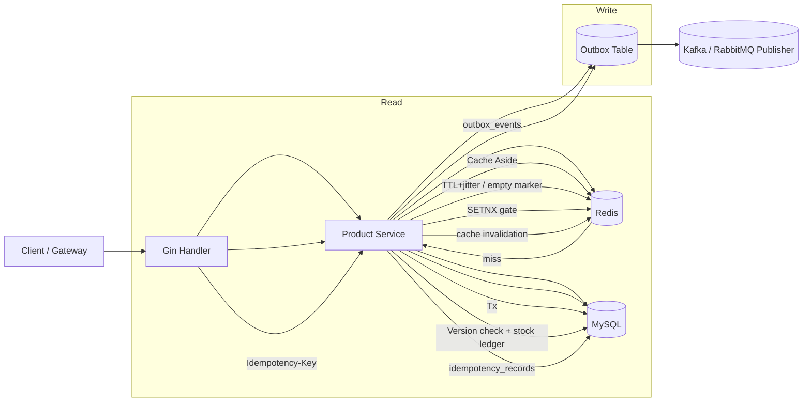

# EShop Product Service

基于 Go + Gin + GORM + Redis 的商品微服务示例，按 DDD 分层组织，包含高并发场景下的缓存、事务、幂等与库存一致性处理。

## 包职责

- `cmd/product`
  - 应用入口，负责初始化 MySQL/Redis、Gin 路由、HTTP Server 参数和优雅停机。
- `internal/product/handler`
  - 接口层（Controller/Handler）。
  - 做参数校验、请求解析、错误码映射，不承载核心业务规则。
- `internal/product/service`
  - 应用服务层（Application Service）。
  - 编排业务流程：幂等判定、事务边界、库存扣减重试、调用 Repository、生成 Outbox 事件。
- `internal/product/repository`
  - 基础设施层（Repository/DAO）。
  - 负责 MySQL 读写、Redis 缓存读写、库存账本、幂等记录、Outbox 持久化。
- `api/proto`
  - 对外 gRPC 接口契约（`product.proto`）。
- `migrations`
  - MySQL DDL（`products`、`product_stock_ledger`、`idempotency_records`、`outbox_events`）。

## 架构与数据流



关键策略：

- 写接口幂等：`Redis SETNX` + `idempotency_records(operation, idem_key)` 双保险。
- 库存一致性：事务内扣减 + 乐观锁版本字段冲突重试（最多 3 次）+ 库存流水。
- 缓存策略：Cache Aside，空值缓存防穿透，TTL 抖动防雪崩。
- 异步一致性：Outbox 表落库后由独立发布器投递 MQ，避免“本地事务提交成功但 MQ 发送失败”。

## API 路由（HTTP）

- `GET /health`
- `GET /products/:id`
- `GET /products?page=1&page_size=20&status=1`
- `POST /products`（Header: `Idempotency-Key`）
- `PUT /products/:id`（Header: `Idempotency-Key`）
- `POST /products/:id/stock`（Header: `Idempotency-Key`）

## 快速启动

1. 准备 MySQL 与 Redis。
2. 执行 `migrations/001_product.sql`。
3. 配置环境变量（可选）：
   - `MYSQL_DSN`
   - `REDIS_ADDR`
   - `REDIS_PASSWORD`
   - `HTTP_ADDR`
4. 启动服务：

```bash
go run ./cmd/product
```

## 当前代码覆盖点

- 完整 Handler / Service / Repository 主链路。
- 事务提交、回滚、防御性错误处理。
- 缓存读写与失效。
- 幂等记录回放。
- 库存扣减冲突重试。
- 库存流水与 Outbox 持久化。
