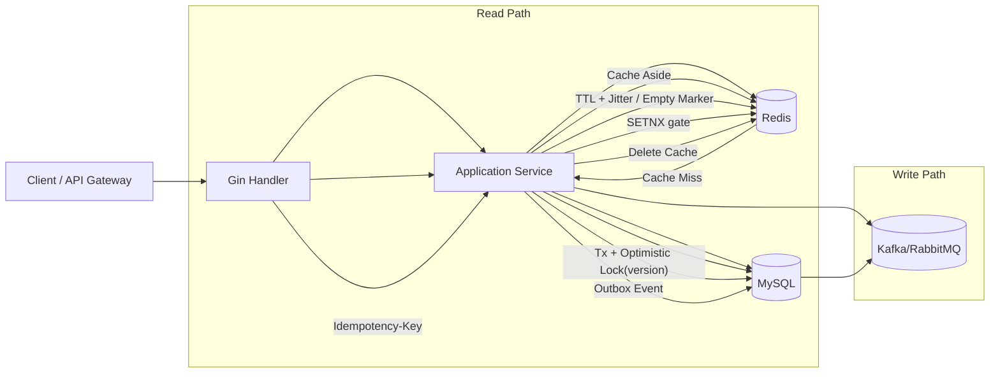

# Product Service Architecture

## 一、架构与数据流向 (Architecture & Data Flow)

- 写请求：`Redis SETNX` + `MySQL idempotency_records` 双层幂等。
- 库存扣减：事务内 `SELECT ... FOR UPDATE` + `version` 乐观锁条件更新，重试 3 次。
- 读请求：Cache Aside，穿透防护用 `__nil__`，雪崩防护用 TTL 随机抖动。

## 二、接口契约与表结构 (Interface & Schema)

- Proto: `api/proto/product.proto`
- DDL: `migrations/001_product.sql`

## 三、核心源码实现 (Core Source Code)

- Repository: `internal/product/repository/product_repository.go`
- Service: `internal/product/service/product_service.go`
- Handler: `internal/product/handler/http_handler.go`
- Entry: `cmd/product/main.go`

## 四、极端场景预案 (Edge Cases Handling)

1. Redis 不可用

- 读链路降级 DB。
- 写链路幂等回退到 MySQL `idempotency_records(operation, idem_key)` 唯一键。

2. 高并发库存扣减冲突

- 事务 + 乐观锁版本号冲突重试（最多 3 次），避免超卖。

3. MQ 重复消费

- 消费者按 `event_id` 或 `request_id` 落幂等记录，重复消息直接 ACK。

4. 缓存雪崩/穿透

- 热点 key TTL 加随机抖动。
- 不存在商品写入短 TTL 的 `__nil__` 空对象缓存。
